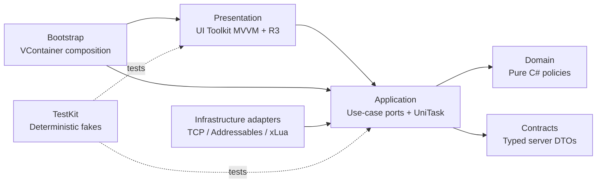

# Echo Unity Migration Harness Design

## Status

Accepted on 2026-07-29. The selected direction is option 1: Clean Architecture with Unity UI Toolkit native MVVM, VContainer, R3, UniTask, Addressables, and a controlled xLua hot-update seam.

The deliverable is a Harness only. Login, matchmaking, battle rules, real TCP networking, production Addressables catalogs, Lua gameplay scripts, art, scenes, and final UI are explicitly out of scope.

## Context

The current product is a verified Godot 4.5 client backed by a Go authoritative server. The client uses a custom TCP protocol:

```text
[4-byte payload length, big-endian][2-byte message ID, big-endian][JSON body]
```

The length covers the JSON body and excludes the two-byte message ID. The current maximum body is 1 MiB. The server processes a room through one authoritative goroutine and emits player-specific views to preserve hidden information.

The migration must therefore optimize for contract safety, deterministic verification, replaceable infrastructure, and long-term team ownership rather than direct scene-for-scene translation.

## Architectural decision



Dependency direction is inward. Domain does not reference Unity, networking, Addressables, Lua, VContainer, R3, or UI. Presentation may observe application state but cannot call infrastructure directly. Bootstrap is the only production composition root. TestKit may implement any port but cannot be referenced by runtime assemblies.

## Assembly boundaries

| Assembly | Responsibility | Allowed dependencies |
|---|---|---|
| `Echo.Harness.Domain` | Pure domain primitives and policy seams | BCL only |
| `Echo.Harness.Contracts` | Message IDs, typed wire DTOs, framing specification | Newtonsoft JSON |
| `Echo.Harness.Application` | Use-case ports and lifecycle orchestration contracts | Domain, Contracts, UniTask |
| `Echo.Harness.Infrastructure` | Transport/content/Lua adapter contracts and adapter markers | Application, Contracts, Addressables, UniTask |
| `Echo.Harness.Presentation` | UI Toolkit MVVM and reactive presentation seams | Application, R3, UI Toolkit |
| `Echo.Harness.Bootstrap` | VContainer registrations and startup health model | all runtime assemblies, VContainer |
| `Echo.Harness.TestKit` | Fakes, probes, fixture builders, manual time | runtime contracts only |

No assembly contains real feature behavior in this Harness.

## Protocol contract strategy

The Go types and JSON tags are authoritative. The Harness stores a machine-readable baseline with every current message ID and migration-critical payload fields. Tests reject:

- duplicate or renumbered message IDs;
- frame-size or endianness drift;
- DTO JSON-name drift;
- missing request/response/event categories;
- client assumptions that conflict with server tags.

Known Godot/Go drift recorded by the Harness:

| Event | Go contract | Existing Godot assumption |
|---|---|---|
| Damage `5001` | `attacker_seat`, `defender_seat`, `raw_damage`, `final_damage`, `hp_after`, `detail` | `seat`, `amount`, `damage_type` |
| Liberation `5003` | `player_seat` | `seat` |
| Field effect `5004` | `effect_id`, `effect_name`, `desc` | `field_effect` |
| Disconnect signal | session lifecycle event | battle handler expects a reason although the signal declares none |

Unity code will not copy the Godot `Dictionary` parsing pattern. Future feature work must add typed DTOs and fixtures before consuming new messages.

## Asynchrony and reactivity

UniTask is the asynchronous API at Unity-facing ports. Every long-lived operation accepts cancellation and is owned by a lifetime scope. R3 is reserved for in-process observable UI state and event composition; it does not model one-shot network calls or authoritative server state transitions.

Tests use manual time and controlled fakes. No test depends on wall-clock sleeps, live servers, production catalogs, or remote Lua bundles.

## Addressables policy

Production code will consume an `IContentProvider` boundary rather than calling Addressables from feature assemblies. The Harness verifies package availability, load/release symmetry, label semantics, and deterministic fake behavior.

Local/remote catalogs, CDN credentials, signing, content builds, and real assets are future implementation tasks.

## xLua policy

xLua sits behind `ILuaRuntime`. The Harness defines lifecycle and sandbox expectations but does not vendor or execute xLua.

Allowed future Lua scope:

- view choreography;
- presentation formatting;
- non-authoritative client configuration;
- controlled UI experiments.

Forbidden scope:

- damage, card legality, turn advancement, rewards, inventory, matchmaking, or any other authoritative decision;
- direct socket access;
- direct Addressables ownership;
- bypassing application ports.

One Lua environment per application lifetime is the default policy. Bundle signature/version verification and rollback are mandatory before production enablement.

## Composition and health

VContainer owns app, session, and scene lifetimes. Startup health reports dependency readiness without starting gameplay. A missing optional xLua runtime is reported as unavailable; missing required packages or invalid protocol fixtures fail verification.

## Test pyramid

1. Static repository checks: package pins, assembly direction, forbidden references, contract JSON shape.
2. EditMode tests: message IDs, DTO JSON names, binary framing, deterministic fakes, cancellation, DI resolution, Addressables/R3/UniTask package smoke checks.
3. PlayMode tests: Unity player-loop availability, lifetime disposal, UI Toolkit binding seam, and leak-safe startup/shutdown.
4. Future integration tests: a disposable Go server process with golden fixtures. Not implemented in this Harness.

## Acceptance criteria

- Unity reports exactly `6000.2.7f2`.
- All dependency versions are pinned.
- Runtime assemblies compile without gameplay implementation.
- EditMode and PlayMode suites pass from the CLI.
- Static architecture validation passes.
- Protocol baseline contains all server message IDs currently observed.
- Fakes make feature development possible without a live server, CDN, or Lua runtime.
- Documentation clearly separates Harness capability from future production implementation.
